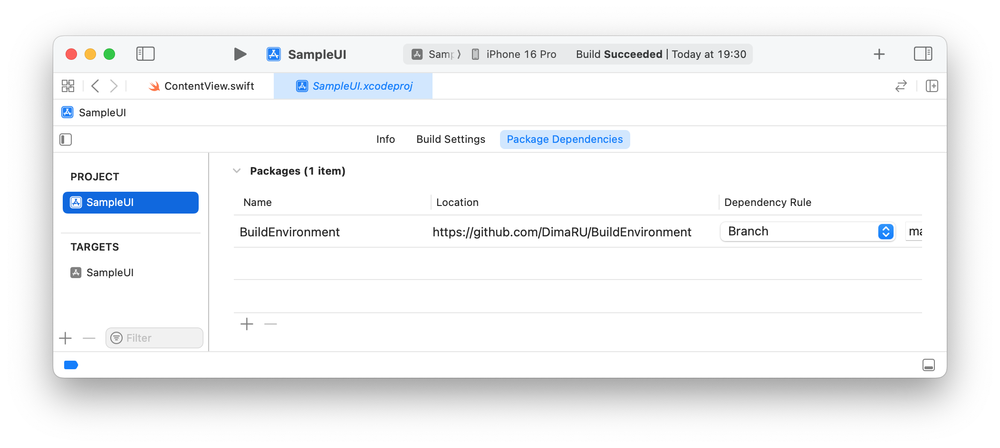
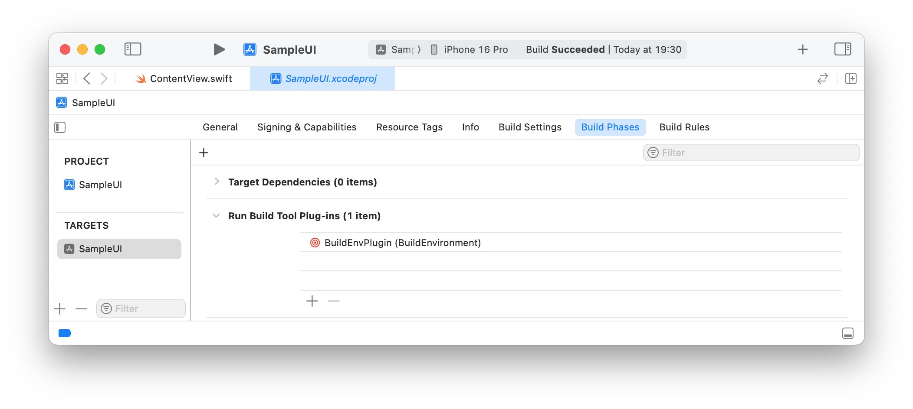

# BuildEvironment

  

<div align="center">
  <p><strong>Store your keys and secrets away from your source code. Designed for both SPM and Xcode projects.</strong></p>
  <a href="https://github.com/DimaRU/BuildEnvironment/releases">
    
  </a>
</div>


## Description

The BuildEvironment project lets you store your keys and secrets away from your repository. Secrets can be stored in the `.env` file or in environment variables. Simple lightweight and functional solution, platform agnostic.

## Getting Started

### Usage

### With Swift package :

- Add the package dependency: 
```swift
.package(url: "https://github.com/DimaRU/BuildEnvironment.git", from: "1.0.0"),
```
- Add plugin to the target:
```swift
plugins: [ .plugin(name: "BuildEnvPlugin", package: "BuildEnvironment") ]
```
- You may have add platform requirements:
```swift
platforms: [.macOS(.v11), .iOS(.v14), .watchOS(.v7), .tvOS(.v14)],
```

### With Xcode project:

- Add package dependency:  
Don't add BuildEnv as a dependency to any target.

- Add plugin to the Target:


#### Add  the`.env`  and/or `buildenv.config` files to the root directory of your project. 

One of the files must be added. 

##### If only `.env` exist, code with default settings will be generated:
- enum name: `BuildEnvironment`
- enum access level: `public`
- encode: no
- variables will be taken from the `.env` file.

> [!caution] 
> The `.env` file shouldn't be committed to git as it contains your secrets. 

##### If your project contain `buildenv.config`:
- you can customize code generation options.
- environment variables can be added.

`buildenv.config` contains no secrets and can be added to the repository.

## Examples

###  Single `.env` file
```bash
# Sample api key
apiKey = "123456"
```
Generated code:

```swift
// Code generated from .env file 
// Don't edit! All changes will be lost.

public enum BuildEnvironment {
    public static let apiKey: String = "123456"
}
```

### Both  `.env` and `buildenv.config`
```
# Sample BuildEnvPlugin config file

# Generated enum name. Default: BuildEnvironment
name: BuildEnvironment
# Generated enum access level.
# Must be one of: public, package, internal. Default: public
access: internal
# Obfuscate data by encode: yes/no. Default: no
encode: yes

# Environment variable list.
# Format: swift_variable_name=$environment_variable_name
userName= $USER
homeDir= $HOME
```
Generated code:

```swift
// Code generated from .env file 
// Don't edit! All changes will be lost.

enum BuildEnvironment {
    static let userName: String = {
        let encrypted: [UInt8] = [191, 121, 218, 23, 127, 221, 219, 20, 179, 99, 13, 164]
        let count = encrypted.count / 2
        return String(unsafeUninitializedCapacity: count) { ptr in
            (0..<count).forEach { ptr[$0] = encrypted[$0] ^ encrypted[$0 + count] }
            return count
        }
    }()
    static let homeDir: String = {
        let encrypted: [UInt8] = [245, 33, 241, 173, 4, 190, 7, 163, 71, 155, 203, 189, 211, 218, 116, 130, 200, 118, 205, 40, 199, 42, 242, 191, 207, 170]
        let count = encrypted.count / 2
        return String(unsafeUninitializedCapacity: count) { ptr in
            (0..<count).forEach { ptr[$0] = encrypted[$0] ^ encrypted[$0 + count] }
            return count
        }
    }()
    static let apiKey: String = {
        let encrypted: [UInt8] = [41, 83, 240, 172, 236, 228, 24, 97, 195, 152, 217, 210]
        let count = encrypted.count / 2
        return String(unsafeUninitializedCapacity: count) { ptr in
            (0..<count).forEach { ptr[$0] = encrypted[$0] ^ encrypted[$0 + count] }
            return count
        }
    }()
}
```

## Sample project:

- Clone current repository
- Run: `swift run BuildEnvExample`

## Contributing

Pull requests are welcome. For major changes, please open an issue first to discuss what you would like to change.

## License

This project is licensed under the MIT License - see the LICENSE file for details

